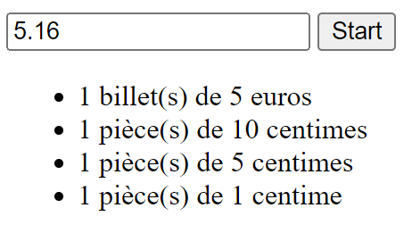

# ATM

Développer un programme qui prend en entrée une certaine somme (d'argent) et qui calcule le nombre de coupures nécessaires pour atteindre cette somme.
Il est évident que le résultat doit être optimisé. Ainsi pour 145 €, 145 pièces de 1€ n'est pas envisageable, sauf si c'est la seule coupure disponible.

Donc si la somme est de 145, le résulat sera le suivant:
- 1 billet de 100
- 2 billets de 20
- 1 billet de 5

## Visuel



### Balises HTML à utiliser

- `<input/>`: `number` ou `text`. À vous d'adapter votre validation en fonction du type d'entrée
- `<button>`: Vous devrez lier un **événement clic** sur votre bouton. Je vous laisse googler ça 😉
- `<ul>`: Listing des résultats

### Quelques instructions JS pour manipuler le code HTML

- `document.getElementById`: Sélectionne un élément désigné par son `id`.
- `document.querySelector`: Sélectionne un élément en fonction du sélecteur. Ex: `.main-content p` correspond à l'ensemble des `<p>` se trouvant dans un élément ayant la classe `.main-content`.
- `innerHTML`: Permet de modifier le contenu d'un élément.

## Déroulement

### Happy flow 🙂

1. L'utilisateur entre un montant (maximum deux décimales)
2. L'utilisateur appuie sur le bouton start
3. Le résultat s'affiche sous forme de liste en dessous du formulaire d'insertion

### Unhappy flow 🙁

1. L'utilisateur entre un montant avec 3 décimales (2 décimales max)
2. L'utilisateur appuie sur le bouton start
3. Un message d'erreur s'affiche sous le formulaire d'insertion

Pour en savoir plus: [Flux du programme (base)](./flow.mmd)

## Indices

### Liste de coupures

L'utilisation d'un tableau pour définir les coupures disponibles est vivement recommandé.

```js
const BILL_TYPE_LIST = [
    0.01, // 1 centime
    5, // 5 euros
    10, // 10 euros
    // ...
];

function makeMoneyChange(amount, billTypeList){
    // ...
    return // ...
}

// In another piece of code..
const result = makeMoneyChange(initialAmount, BILL_TYPE_LIST);
```

### Divides and conquers

Diviser pour régner! C'est la règle d'or. Le programme pourrait être découpé de la sorte:

- Une fonction pour la validation
- Une fonction qui effectue le changement en coupure (`makeMoneyChange`)
- Une fonction qui affiche le résultat etc...

### Résulat de la fonction `makeMoneyChange`

Afin de pouvoir exploiter au mieux le résultat de cette fonction, cette dernière va retourner un tableau d'objets ayant comme propriétés:
- **value**: La valeur de la coupure: 1 centime, 1 euro, etc...
- **quantity**: Le nombre de coupures

Exemple pour 9€:
```json
[
    {"value": 5, "quantity": 1},
    {"value": 2, "quantity": 2}
]
```
> Note: À l'aide d'une boucle ou de la fonction `reduce()`, il est possible de calculer le montant initial.

## Problème lié aux décimales

Certaines opérations mathématiques ne produisent pas toujours le résulat attendu quand cela concerne les nombres décimaux.

```js
const soustraction = 5.16 - 0.06;
console.log(soustraction); // > 5.1000000000000005 (✖ NOK, should be 5.1)
```

### Utilisation de `toFixed()`

```js
const soustraction = 5.16 - 0.06;
const fixed = Number(soustraction.toFixed(2)); // toFixed retourne une chaîne de caractère: '5.10'. L'argument 2 détermine le nombre de chiffres après la virgule (le point)
console.log(soustraction); // > 5.1 (✔ OK)
```

> NOTE: Pour en savoir plus: [Number.prototype.toFixed()](https://developer.mozilla.org/en-US/docs/Web/JavaScript/Reference/Global_Objects/Number/toFixed)

### Multiplication et division par 100

1. Multiplier chaque opérande par 100
2. Effectuer l'opération
3. Diviser le résultat par 100

```js
const nb1 = 5.16;
const nb2 = 0.06;
const result = ((nb1*100) - (nb2*100))/100;
```