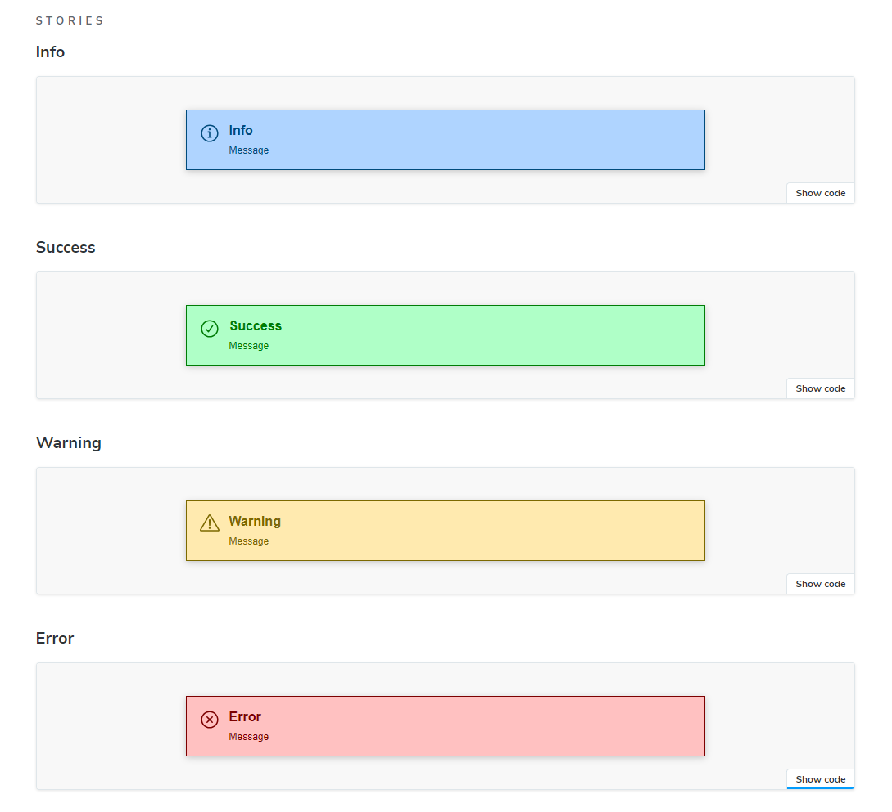

# Composant Alert

Le but de cet exercice est de concevoir un composant affichant une alerte et de concevoir la story qui lui est associée.

## Aperçu



## Signature

```html
<AlertBox variant="Info" title="Titre de l'alerte">Contenu de l'alerte</AlertBox>
```

## Dossier et fichiers à remettre

Le code source du composant va se trouver dans `test-sb/src/components/AlertBox` et devra contenir les fichiers suivants:

- AlertBox.tsx
- AlertBox.module.css
- AlertBox.stories.ts

> **NOTE**: Si vous avez des fichiers additionnels (composants d'icône ou autre), n'oubliez pas de les transmettre.
> Tout comme si vous installez une librairie, n'oubliez de le communiquer également via une note, un readme.md etc...

## Caractéristiques techniques

### Icônes

Source: https://www.radix-ui.com/icons

- Abstract
  - Check Circled
  - Cross Circled
  - Exclamation Triangle
  - Info Circled

### Couleurs

- #004b7c (bleu foncé)
- #afd4ff (bleu clair)
- #007c06 (vert foncé)
- #afffc7 (vert clair)
- #7c6900 (jaune foncé)
- #ffeaaf (jaune clair)
- #7c0000 (rouge foncé)
- #ffc1c1 (rouge clair)

Les couleurs foncées sont utilisées pour la police, l'icône et la bordure.
Les couleurs claires sont utilisées pour l'arrière-plan.

### Dimensions

- Taille des bordures: 1px
- Espaces internes de la box: 16px
- Longueur min de la box: 600px
- Tailles de police:
  - 16px pour l'en-tête
  - 12px pour le corps
- Graisse:
  - En-tête: gras
  - Corps: normal
- Taille de l'icône: 24 x 24px
- Espace entre le block contenant l'icône et le block de contenu (en-tête + corps): 12px
- Espace entre l'en-tête et le corps: 8px

## Conseils et astuces

### Bac à sable

Avant de vous attaquer à la partie React/Storybook, je vous recommande vivement dans un premier temps de créer le code HTML/CSS dans un fichier à part qui vous servira de "bac à sable".
C'est une pratique que j'applique systématiquement avant de m'attaquer à la partie framework pour des composants complexes.

  ```html
  <!DOCTYPE html>
    <html lang="en">
    <head>
        <meta charset="UTF-8">
        <meta name="viewport" content="width=device-width, initial-scale=1.0">
        <title>Document</title>
        <style type="text/css">
            /* Vos classes css */
        </style>
    </head>
    <body>
        <!-- Votre code HTML -->
    </body>
  </html>
  ```
De cette façon vous pourrez vous assurer que le code HTML/CSS est fonctionnel.

### SoC (Separation of Concern)

Il s'agit ici d'une règle qu'on applique dans le développement. Dans ce cas-ci, vous pourrez l'appliquer pour la conception de vos classes css.
En effet, on peut séparer les styles en deux catégories:
- Styles communs (espacement, police etc...)
- Styles spécifiques au variant (Success, Error,...)

### Affichage conditionnel dans React

Vous en aurez sûrement besoin pour l'affichage de l'icône. Ce lien vous donne toutes les infos: https://react.dev/learn#conditional-rendering

### Composant d'icône

Il s'agit d'une pratique assez courante d'utiliser du code SVG dans du code HTML.
Si vous copiez/coller le code svg de l'icône depuis https://www.radix-ui.com/icons, je vous conseille de créer un composant séparé.

Pour ça, rien de plus facile:

```tsx
function HeartIcon(){
    return <svg 
        width="15" 
        height="15" 
        viewBox="0 0 15 15" 
        fill="none" 
        xmlns="http://www.w3.org/2000/svg">
            <path d="M1.35248 4.90532C1.35248 2.94498 2.936 1.35248 4.89346 1.35248C6.25769 1.35248 6.86058 1.92336 7.50002 2.93545C8.13946 1.92336 8.74235 1.35248 10.1066 1.35248C12.064 1.35248 13.6476 2.94498 13.6476 4.90532C13.6476 6.74041 12.6013 8.50508 11.4008 9.96927C10.2636 11.3562 8.92194 12.5508 8.00601 13.3664C7.94645 13.4194 7.88869 13.4709 7.83291 13.5206C7.64324 13.6899 7.3568 13.6899 7.16713 13.5206C7.11135 13.4709 7.05359 13.4194 6.99403 13.3664C6.0781 12.5508 4.73641 11.3562 3.59926 9.96927C2.39872 8.50508 1.35248 6.74041 1.35248 4.90532Z" 
        fill="currentColor" 
        fillRule="evenodd" 
        clipRule="evenodd"></path>
    </svg>
}
```

Ensuite dans le composant principal:

```tsx
export function MyComponent(){
    return <div>
        <span>Mon icône:</span>
        <HeartIcon />
    </div>
}
```

> **NOTE**: Les attributs `fill-rule` & `clip-rule` doivent être renommé en camel case (`fillRule` & `clipRule`) sinon React va générer une erreur dans le navigateur.

> **NOTE 2**: Si vous créez vos composants d'icône dans des fichiers séparés (ce qui est une bonne pratique), n'oubliez pas le mot-clé `export` devant votre fonction de composant.

### Inspirez-vous de ce qui a été fait en classe

- Composant Button
- Composant Badge

## Liens utiles

- [CSS Flexbox Layout Guide](https://css-tricks.com/snippets/css/a-guide-to-flexbox/)
- [Create and Nesting components](https://react.dev/learn#components)
- [Writing markup with JSX](https://react.dev/learn#writing-markup-with-jsx)
- [Adding styles](https://react.dev/learn#adding-styles)
- [Displaying data](https://react.dev/learn#displaying-data)
- [Conditional rendering](https://react.dev/learn#conditional-rendering)

Bon travail!